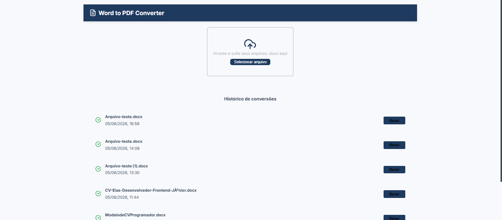
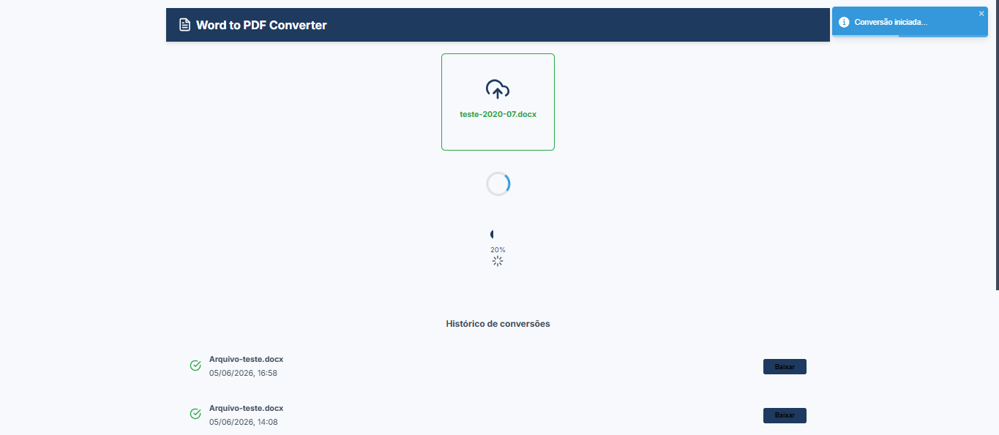
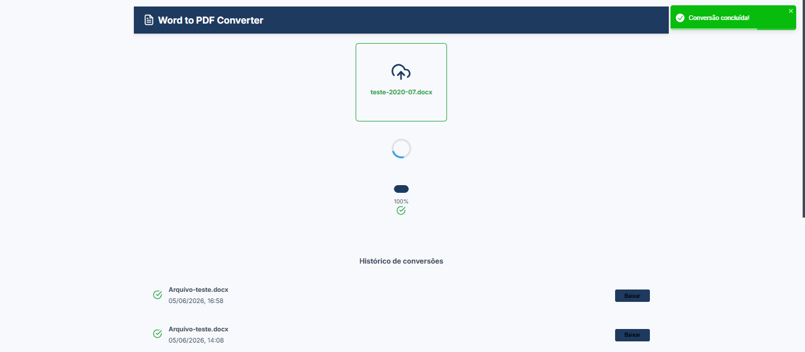
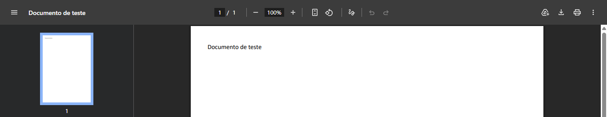
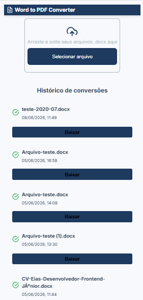
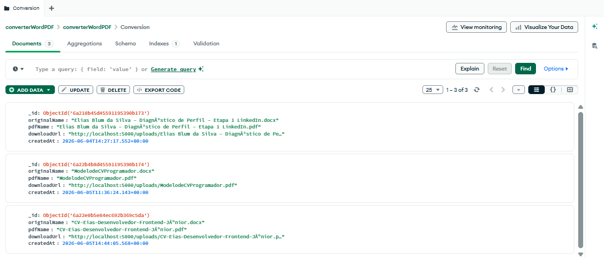

# Conversor Word PDF

## Sobre o projeto

O Conversor Word PDF é uma aplicação full stack desenvolvida para realizar a conversão de arquivos Word (.doc e .docx) em formato PDF. A solução oferece um fluxo completo de upload, validação, processamento e entrega do arquivo final, permitindo o download imediato e o registro do histórico das conversões. O objetivo técnico desta aplicação foi integrar front-end e back-end para resolver um problema prático de manipulação de documentos, mantendo uma interface responsiva e uma arquitetura organizada.

## Funcionalidades

- Envio de arquivos Word para processamento.
- Validação de tipos de arquivo permitidos com recusa de formatos inválidos.
- Conversão automatizada de Word para PDF.
- Exibição de alertas para arquivos incompatíveis.
- Notificações via toast durante o início, sucesso ou erro da conversão.
- Disponibilização de link para download do arquivo convertido.
- Registro e persistência do histórico de conversões no banco de dados.

## Tecnologias utilizadas

- Linguagem: JavaScript
- Framework/Biblioteca: React, Node.js, Express, Multer, Axios, React Toastify, React Icons e LibreOffice
- Banco de dados: MongoDB
- Estilização: styled-components
- Ferramentas: Git/GitHub
- Testes: Jest
- Integrações: A aplicação integra o frontend, backend, banco de dados MongoDB e o LibreOffice para processar o upload, realizar a conversão e disponibilizar o arquivo para download.
- Outros recursos técnicos: Validação de dados, upload de arquivos, manipulação de arquivos e histórico de conversões.

## Como executar o projeto

- git clone https://github.com/Eliassilva98/Conversor-Word-PDF.git
- Acessar a pasta do projeto.
- Instalar as dependências do frontend e backend com o comando yarn install.
- Configurar as variáveis de ambiente no arquivo .env com PORT=5000, UPLOAD_DIR=src/uploads, SOFFICE_PATH=C:\\Program Files\\LibreOffice\\program\\soffice.exe e DATABASE_URL="mongodb+srv://<USUARIO>:<SENHA>@<CLUSTER>.mongodb.net/<NOME_DO_BANCO>?appName=<NOME_DO_APP>"
- Iniciar o backend com o comando cd backend && yarn dev.
- Iniciar o frontend com o comando yarn dev.
- Abrir o navegador no endereço informado no terminal, geralmente http://localhost:3000 ou http://localhost:5173.

## Organização do projeto

- Frontend: src, assets, components, containers, services, styles, utils
- Backend: src, config, controllers, routes, uploads

## O que este projeto demonstra

- Construção de uma aplicação com fluxo completo de dados.
- Organização de código baseada na separação de responsabilidades.
- Implementação de regras de negócio aplicadas ao processamento de arquivos.
- Validação de dados e tratamento de erros.
- Persistência de informações em banco de dados não relacional.
- Uso prático das tecnologias escolhidas em um cenário de integração.
- Estruturação de projeto voltada para manutenção e escalabilidade.

## Melhorias futuras

- Inclusão de novas conversões de arquivos, como a transformação de documentos de texto simples em PDF.
- Integração de um assistente de inteligência artificial para suporte ao usuário.
- Implementação de sistema de cadastro e autenticação de usuários.

## Screenshot do projeto

